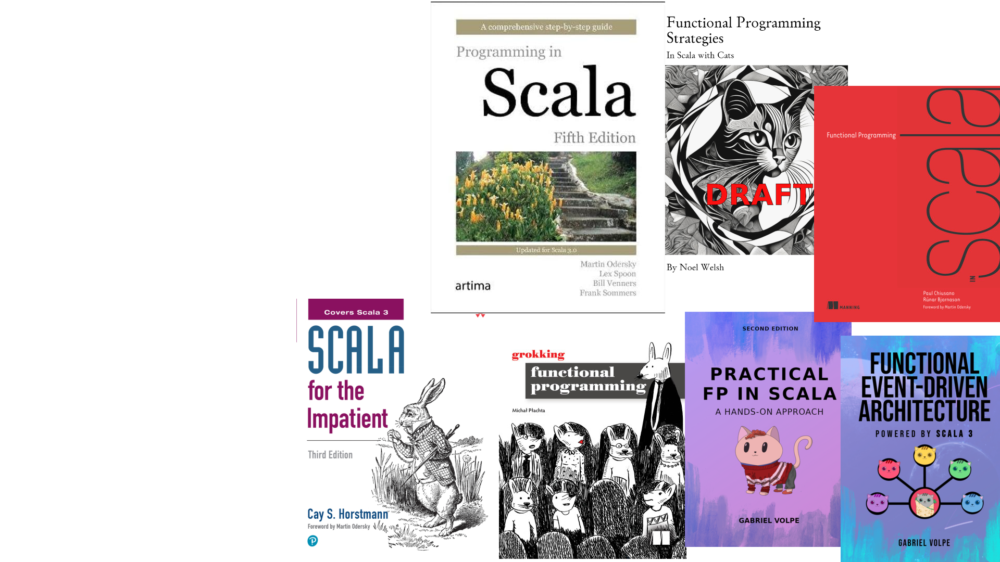

#### Scala in 2025
# How to Start, What to Learn


<!-- class: line-numbers -->

<!-- 
Talk plan

1. Briefly what Scala is
 * OOP and FP
 * Multiplatform
 * Backed by academia, not corporations
2. IDEs 
 * Intellij 
   * How to install
   * Scala plugin (https://github.com/JetBrains/intellij-scala)
   * Pros (out of the box, familiar for Java devs/Pycharm users)
   * Cons (errors can be out of sync, non OSS editor)
 * Metals 
   * How to install (Editor of choice)
   * Pros (in sync with the compiler, latest compiler features)
   * Cons (unequal experience across editors, requires reimport more often than intellij)
3. Build tools
 * What are they
 * sbt, scala-cli, just mention mill
 * scala-cli good enough for starters
4. Flavors of Scala
 * Good old OOP with https://www.playframework.com
 * Python like with Li Haoi https://www.lihaoyi.com/post/12yearsofthecomlihaoyiScalaPlatform.html
 * Direct style concurrency with Ox https://ox.softwaremill.com/latest
 * Hardcore FP with Cats Effect https://typelevel.org/cats-effect
 * Actors with Pekko/Akka
 * Many more
   * ZIO
   * Spark
   * Casual FP
   * Everything in between 
5. Benefits of giving it a try (key takeaways)
 * Scala fits many problem spaces, perhaps it fits yours
 * Type system can make the experience safer and more pleasant
 * Multi-platforming across JVM, JS and Native is an added benefit
 * Learn a lot, broaden your horizons
 * Coding styles can be mixed

ideas:
 * consider mentioning companies that use Scala
 * list learning resources, probably done best next to each subpoint of #4

todos:
 * validate code samples, perhaps extract them with mdoc
 * verify the dependencies, if they are necessary and on latest versions

 -->


---

# What is Scala?

- Combines Object-Oriented and Functional Programming
- Runs on JVM, JavaScript, and Native platforms

---

# Academic Roots

- Developed at EPFL, by Martin Odersky 
- Community-driven evolution rather than corporate interests

---

# Before we move on ☝️

Something too obvious? something missing? 
Ping me on Slack


---

# Why try Scala?


1. Type-Driven Development
2. Multi-Platform Support
3. Ecosystem Diversity
4. Career Growth
5. Modern Features

---

# Type-Driven Development

```scala
// The compiler catches errors before runtime
case class User(name: String, age: PosInt)

val user = User("John Doe", -1) // this won't compile
```

---

# Multi-Platform Support

```scala
// Same code, different platforms
object HelloWorld {
  def sayHello(): String = "Hello, World!"
}

// JVM:    scala-cli run .
// JS:     scala-cli --platform js run .
// Native: scala-cli --platform native run .
```

---

# Ecosystem Diversity

Choose your style:
```scala
// Object-Oriented with Play
class UserController extends Controller {
  def users = Action { Ok(getUsers()) }
}

// Functional with Cats Effect
def users[F[_]: Async]: F[List[User]] = UserRepo[F].findAll

// Script-style with Cask
@get("/users") def users() = getUserList()
```

---

# Career Growth

- Strong presence in fintech and streaming platforms
- High demand in data engineering and distributed systems
- Competetive salaries 

---

# Modern Features

```scala
// Pattern matching
value match {
  case Success(data) => process(data)
  case Failure(err)  => handleError(err)
}

// Extension methods
extension (n: Int) {
  def squared: Int = n * n
}
5.squared

// Context functions
def setup(using Config): Unit = ???
given Config = loadConfig()
setup()
```

---

# IDE Choice


---

# IDE Choice: IntelliJ


1. Download IntelliJ IDEA (Community or Ultimate)
2. Install Scala plugin: Settings → Plugins → "Scala"

---

# IntelliJ: Pros & Cons

✅ Familiar interface for Java/PyCharm users, rich features out of the box
❌ Compiler errors can be out of sync, non-open-source editor

---

# IntelliJ: Install

https://www.jetbrains.com/help/idea/get-started-with-scala.html

---

# IDE Choice: Metals


Language Server that works with VS Code, Vim, Emacs, and others. 

Install through your editor's extension marketplace.

---

# Metals: Pros & Cons

✅ Always in sync with compiler, supports latest features
❌ Experience varies between editors


---

# Metals: Install

https://scalameta.org/metals/docs

---


# Build Tools Overview

### Manage dependencies, compile code, and run tests

---

# scala-cli: The Simple Choice


* ❌ Not technically a build tool
* ✅ Nobody cares

---

# scala-cli: The Simple Choice


Modern, user-friendly build tool designed for:
- Single-file scripts
- Small projects
- Quick prototypes

---

# scala-cli: Install

Just install Scala!

https://docs.scala-lang.org/getting-started/install-scala.html

---

# scala-cli: Perfect for Learning

```scala
// add dependencies
//> using lib com.lihaoyi::pprint:0.9.0

// define scala version
//> using scala 3.3.5

@main def hello() = 
  pprint.log("No build config needed!")
```

---

# scala-cli: Just run it


```bash
# Run a single file
scala Hello.scala
scala-cli Hello.scala 
# ☝️ if you installed from https://scala-cli.virtuslab.org/
```

---

# sbt: The Power Tool


Industry standard build tool for:
- Multi-module projects
- Complex dependency management 
- Custom build tasks
- Code generation

---

# sbt: Project Structure

```markdown
build.sbt            # build config
project/
  build.properties   # sbt version
  plugins.sbt        # plugins
src/
  main/
    scala/           # source code
  test/
    scala/           # test code
```

---

# sbt: Configuration Example

```scala
// build.sbt
name := "my-project"
version := "0.1.0"

lazy val root = (project in file("."))
  .settings(
    scalaVersion := "3.3.1",
    libraryDependencies ++= Seq(
      "org.typelevel" %% "cats-effect" % "3.5.4",
      "org.scalatest" %% "scalatest" % "3.2.15" % Test
    )
  )
```

---

# When to Use What?
<style scoped>
.columns {
  display: grid;
  grid-template-columns: repeat(2, 1fr);
  gap: 1rem;
}
</style>

<div class="columns">
  <ul><strong>scala-cli</strong>
    <li>Learning Scala</li>
    <li>Scripts & prototyping</li>
    <li>Single-module applications</li>
  </ul>
  <ul><strong>sbt</strong>
    <li>Multi-module applications</li>
    <li>Code generation</li>
    <li>Managing CI/CD pipelines</li>
  </ul>
</div>


---

# Mill: Alternative

* Multi-language build tool: Scala, Java, Kotlin, Python
* https://github.com/com-lihaoyi/mill

---

# Flavors of Scala

Coding styles and frameworks


---


# Cask: Flask but for Scala

Li Haoyi Style

Inspired by Python's Flask

https://com-lihaoyi.github.io/cask/


---

# Li Haoyi Style: Getting Started

Create new directory and file:
```bash
mkdir cask-demo
cd cask-demo
touch app.scala
```

---

# Li Haoyi Style: Web Server with Cask

```scala
//> using lib "com.lihaoyi::cask:0.9.2"
object app extends cask.MainRoutes:

  @cask.post("/greet")
  def greet(name: String) = s"Hello, $name!"
  
  @cask.get("/users/:userId")
  def user(userId: Int) = 
    val users = Map(1 -> "Alice", 2 -> "Bob")
    users.getOrElse(userId, "User not found")

  initialize()

// Start server
@main def run() = 
  cask.main.Main.main(args = Array("app"))
```

---

# Li Haoyi Style: Testing the API

Run with: `scala-cli app.scala`

```bash
# Test the endpoints
curl http://localhost:8080
curl -X POST -d "name=John" http://localhost:8080/greet
curl http://localhost:8080/users/1
```

---

# Li Haoyi: Development platform

There's more: Scalatags, FastParse, uTest, uPickle, Ammonite, Sourcecode, Mill, PPrint, OS-Lib, Requests-Scala, Cask, MainArgs, ScalaSql

Read more in [12 years of the com.lihaoyi Scala Platform](https://www.lihaoyi.com/post/12yearsofthecomlihaoyiScalaPlatform.html#what-is-the-comlihaoyi-platform)


---

# Play Framework: Web Development


---

# Play Framework: Web Development

Start with sbt:
```bash
sbt new play-scala-seed.g8
cd play-scala-seed
sbt run
```

---

# Play Framework: Hello World

```scala
// app/controllers/HelloController.scala
package controllers
import javax.inject._
import play.api.mvc._

@Singleton
class HelloController @Inject()(val controllerComponents: ControllerComponents) 
    extends BaseController {

  def hello() = Action { implicit request: Request[AnyContent] =>
    Ok("Hello, World!") // here goes your logic
  }
}
```

---

# Play Framework: Route Configuration

```groovy
# conf/routes
GET     /hello      controllers.HelloController.hello()
```

Run `sbt run` and visit http://localhost:9000/hello to see your message!


---

# Cats Effect

The pure asynchronous runtime for Scala

https://typelevel.org/cats-effect


---

# Cats Effect: Dependencies

```scala
//> using lib "org.typelevel::cats-effect:3.5.4"
import cats.effect.{IO, IOApp, Resource}
import cats.syntax.parallel._
```

---
# Cats Effect: database connection

```scala
object DbConnection {
  def connect(name: String): IO[DbConnection]
}
class DbConnection {
  def query[A](sql: String): IO[A] = ???
  def close: IO[Unit]
}
```

---

# Cats Effect: Read file

```scala
import java.nio.file.{Files, Path, Paths}
import scala.jdk.CollectionConverters.*

def listFiles: IO[List[UserFiles]] = {
  IO.blocking {
    Files.list(Paths.get("."))
      .iterator()
      .asScala
      .filter(_.toString.endsWith(".txt"))
      .toList
  }
}
```

---
# Cats Effect: Program

```scala
object Demo extends IOApp.Simple {
  def createConnection(name: String): Resource[IO, DbConnection] =
    Resource.make(DbConnection.connect(name))(_.close)

  def run: IO[Unit] = {
    val program = (
      createConnection("users").use(_.query[User]("SELECT ...")),
      createConnection("prefs").use(_.query[UserPrefs]("SELECT ...")),
      listFiles
    ).parMapN{(user, prefs, files) => 
      s"${user.name} uses ${prefs.theme} theme in files ${files}"
    }

    program.handleErrorWith(err => 
      IO.raiseError(new Exception("Failed: " + err.getMessage))
    )
  }
}
```

---


# Pekko

Concurrent, distributed, resilient systems with Actor model

---


<!-- _transition: fade -->

---


<!-- _transition: fade -->

---


<!-- _transition: fade -->

---


<!-- _transition: fade -->

---


<!-- _transition: fade -->

---


---

# Pekko: Actor Systems

Create new project:
```bash
mkdir pekko-demo
cd pekko-demo
touch Counter.scala
```

---

# Pekko: Message Protocol

```scala
//> using lib "org.apache.pekko::pekko-actor-typed:1.0.2"
import org.apache.pekko.actor.typed.{ActorRef, ActorSystem, Behavior}
import org.apache.pekko.actor.typed.scaladsl.Behaviors

object Counter:
  // Define messages our actor can receive
  enum Message:
    case Increment
    case GetValue(replyTo: ActorRef[Int])
```

---

# Pekko: Actor Implementation

```scala
object Counter:
  // Previous Message definition...
  
  def apply(): Behavior[Message] = counter(0)

  private def counter(value: Int): Behavior[Message] =
    Behaviors.receive { (context, message) =>
      message match
        case Message.Increment =>
          println(s"Incrementing counter to ${value + 1}")
          counter(value + 1)
          
        case Message.GetValue(replyTo) =>
          replyTo ! value
          Behaviors.same
    }
```

---

# Pekko: Running the System

```scala
@main def run() =
  // Create the actor system
  val system = ActorSystem(Counter(), "CounterSystem")
  
  // Create an actor to receive responses
  val printer = ActorSystem(
    Behaviors.receive[Int] { (context, msg) =>
      println(s"Current value: $msg")
      Behaviors.same
    },
    "printer"
  )
  
  // Send messages
  system ! Counter.Message.Increment
  system ! Counter.Message.Increment
  system ! Counter.Message.GetValue(printer.ref)
  
  // Keep the program running
  Thread.sleep(1000)
  
  // Shutdown
  system.terminate()
  printer.terminate()
```

---

# Pekko: Running the Example

Run the program:
```bash
scala-cli Counter.scala
```

Output:
```bash
Incrementing counter to 1
Incrementing counter to 2
Current value: 2
```

---


# Ox

Safe direct-style concurrency and resiliency for Scala on the JVM


---

# Ox: Modern Concurrency

Create new project:
```bash
mkdir ox-demo
cd ox-demo
touch Main.scala
```

---

<!-- TODO change the example to more explanatory -->

# Ox: Dependencies

```scala
//> using lib "com.softwaremill.ox::ox-core:0.0.10"
//> using lib "org.http4s::http4s-ember-client:1.0.0-M40"

import ox.*
import cats.effect.*
import org.http4s.ember.client.EmberClientBuilder

@main def download() = ox.scoped {
  // Download multiple URLs concurrently
  val urls = List(
    "https://example.com",
    "https://example.org"
  )
  
  urls.parTraverse { url =>
    println(s"Downloading $url...")
    Thread.sleep(1000) // Simulate work
    println(s"Downloaded $url")
  }
}
```

Run with: `scala-cli Main.scala`


---

# That's just the beginning!

<!-- _transition: fade -->


---

# Other Popular Flavors


- Spark: Big data processing
- Functional streams with FS2
- ZIO: Effect system with built-in dependency injection
- Kyo: Novel approach based on algebraic effects
- Gears: Experimental async programming for Scala
- Casual FP: Mix and match functional concepts
- And a lot more

---

# Learning


---


# Learning is a process

There are plenty of ways to learn

1) Courses
2) Books
3) Blogs
4) Forums
5) Meetups and converences

---


# Courses

---


# Functional Programming in Scala Specialization
##### (a.k.a.) Coursera Course

Co-authored by Martin Odersky, author of Scala

---

<!-- 
In my private opinion, two first should be mandatory.

Even if you don't plan to use Scala professionally, it teaches you a lot about functional programming techinques
-->


# Functional Programming in Scala Specialization

5 courses specialization

1. Functional Programming Principles in Scala
2. Functional Program Design in Scala
3) Parallel programming
4) Big Data Analysis with Scala and Spark
5) Functional Programming in Scala Capstone

https://www.coursera.org/specializations/scala

---

<!-- Paid, discount codes available -->


# Rock the JVM

Led by Daniel Ciocîrlan, offers Scala courses all proficiency levels

https://courses.rockthejvm.com

* [Scala at Light Speed](https://www.youtube.com/playlist?list=PLmtsMNDRU0BxryRX4wiwrTZ661xcp6VPM) free on Youtube
* Scala Essentials 
* The Scala Bundle 

---


# Rock the JVM: Discount code!

<!-- _transition: fade -->

---


# Rock the JVM: Discount code!

`FUNCTIONAL_TALKS`

---


# Alvin's Courses

Created by Alvin Alexander, author of https://alvinalexander.com/, 
["Functional Programming, Simplified"](https://alvinalexander.com/scala/functional-programming-simplified-book/), ["Scala Cookbook"](https://scalacookbook.com/)

Offers free Scala courses at https://www.learnscala.dev/

---


# Youtube channels

## Podcasts & talks
[Scala Space](https://www.youtube.com/@scalaspace) · [Scala for fun and profit](https://www.youtube.com/@Scala-for-Fun-and-Profit/videos) · [Softwafemill](https://www.youtube.com/@SoftwareMillCom/videos) · [Scaladays](https://www.youtube.com/@ScalaDaysConferences)

## Learning
[Rock The Jvm](https://www.youtube.com/@rockthejvm) · [Jakub Kozłowski](https://www.youtube.com/@kubukoz_/videos) · [Dev inside you](https://www.youtube.com/@DevInsideYou/videos) · [IntelliJ IDEA, a JetBrains IDE](https://www.youtube.com/@intellijidea/videos)

And more https://www.nbshare.io/blog/best-scala-tutorials-on-youtube/

---

# Books
<!-- _transition: fade -->




---

# Books
<!-- _transition: fade -->


### Programming in Scala
Comprehensive guide by Martin Odersky

### Grokking functional programming
by Michał Płachta easy way to learn functional programming for those familiar with the OOP ideas

### Functional Programming Strategies In Scala with Cats
by Noel Welsh, compendium on learning Cats library


---

# Books


### Functional programming in Scala 
a.k.a. "The red book", your go-to book for hands-on, advanced functional programming 


### Practical FP in Scala
For those familiar with functional programming in Scala who are yet not confident about architecting an application from scratch

### Functional Event-Driven Architecture
Explore the event-driven architecture (EDA) in a purely functional way.

Many more https://docs.scala-lang.org/books.html https://whatpixel.com/best-scala-books/


---

# Blogs
<!-- _transition: fade -->


---

# Blogs
<!-- _transition: fade -->


<style>
  .tag-cloud {
    display: flex;
    flex-wrap: wrap;
    justify-content: center;
    align-items: center;
    /* font-size: 16px; */
    gap: 10px;
  }
  .tag-cloud a {
    text-decoration: none;
    color: white;
    padding: 5px;
  }
  .tag-cloud a:hover {
    text-decoration: underline;
  }
  .font-size-18 { font-size: 18px; }
  .font-size-20 { font-size: 20px; }
  .font-size-22 { font-size: 22px; }
  .font-size-24 { font-size: 24px; }
  .font-size-26 { font-size: 26px; }
  .font-size-28 { font-size: 28px; }
  .font-size-30 { font-size: 30px; }
  .font-size-32 { font-size: 32px; }

</style>

<div class="tag-cloud">
  <a href="https://www.softinio.com" class="font-size-18">Salar Rahmanian</a>
  <a href="https://www.scala-lang.org/blog/" class="font-size-22">Scala Lang</a>
  <a href="https://typelevel.org/blog/" class="font-size-20">Typelevel</a>
  <a href="https://mpilquist.github.io/" class="font-size-24">Michael Pilquist</a>
  <a href="http://justinhj.github.io/" class="font-size-26">Justin Heyes-Jones</a>
  <a href="https://www.chris-kipp.io/" class="font-size-28">Chris Kipp</a>
  <a href="https://blog.indoorvivants.com" class="font-size-30">Anton Sviridov</a>
  <a href="https://jamesward.com" class="font-size-32">James Ward</a>
  <a href="https://eed3si9n.com/" class="font-size-18">Eugene Yokota</a>
  <a href="https://alexn.org/blog/" class="font-size-22">Alexandru Nedelcu</a>
  <a href="https://blog.kubukoz.com/" class="font-size-20">Jakub Kozłowski</a>
  <a href="https://yadukrishnan.live/" class="font-size-24">Yadu Krishnan</a>
  <a href="https://blog.michal.pawlik.dev/" class="font-size-26">Michał Pawlik</a>
  <a href="https://www.lihaoyi.com/" class="font-size-28">Haoyi Li</a>
  <a href="https://blog.rockthejvm.com/" class="font-size-30">Rock The JVM Blog</a>
  <a href="https://toniogela.dev/" class="font-size-32">Antonio Gelameris</a>
  <a href="https://juliano-alves.com/" class="font-size-18">Juliano Alves</a>
  <a href="https://inner-product.com/" class="font-size-22">Inner Product</a>
  <a href="https://rossabaker.com/" class="font-size-20">Ross Baker</a>
  <a href="https://xebia.com/blog/" class="font-size-24">Xebia</a>
  <a href="https://chollinger.com/blog/" class="font-size-26">Chistian Hollinger</a>
  <a href="https://antonkw.github.io/" class="font-size-28">Anton Kovalevsky</a>
  <a href="https://medium.com/tag/scala" class="font-size-30">Medium (tag Scala)</a>
  <a href="https://virtuslab.com/blog/" class="font-size-32">VirtusLab</a>
  <a href="https://www.madewithtea.com" class="font-size-18">Jendrik Poloczek</a>
  <a href="https://blog.pierre-ricadat.com/" class="font-size-22">Pierre Ricadat</a>
  <a href="https://lachlan.hashnode.dev" class="font-size-20">Lachlan O'Dea</a>
  <a href="https://softwaremill.com/blog/" class="font-size-24">SoftwareMill</a>
  <a href="https://github.com/rssh/notes" class="font-size-26">Ruslan Shevchenko</a>
  <a href="https://neander.tech" class="font-size-28">Neandertech</a>
  <a href="https://scalameta.org/metals/blog/" class="font-size-30">Scala Metals</a>
  <a href="https://podcasters.spotify.com/pod/show/julien-truffaut" class="font-size-32">Scala for Fun and Profit</a>
  <a href="https://cloudmark.github.io/" class="font-size-18">Mark Galea</a>
  <a href="https://blog.rhetoricalmusings.com" class="font-size-22">A Developer's Experience</a>
  <a href="https://day-to-day-stuff.blogspot.com/" class="font-size-20">Erik van Oosten</a>
</div>


---

# Blogs


https://www.scalanews.net/Resources/Blog_Directory.html

---

# Community

Your go-to list of forums, chat rooms, local user groups, and conferences

https://www.scala-lang.org/community


---

# Forums

[Scala Poland 🇵🇱](https://join.slack.com/t/scala-poland/shared_invite/zt-1jeq834yd-iOTH4U1Gto3YWu_lEVY5oA) on Slack
[Scala](https://discord.com/invite/scala) on discord
[Reddit r/scala](https://old.reddit.com/r/scala/)
[Scala Users Discourse](https://users.scala-lang.org/)
[Scala Contributors Discourse](https://contributors.scala-lang.org/)

<!-- second slide with a more comprehensive list of forums -->

---

# Forums


**[IntelliJ](https://discord.gg/aUKpZzeHCK)** · **[Scalameta](https://discord.gg/RFpSVth)** · **[Play Framework](https://discord.gg/g5s2vtZ4Fa)** · **[Typelevel](https://discord.gg/XF3CXcMzqD)** · **[ZIO](https://discord.gg/2ccFBr4)** · **[Laminar](https://discord.gg/JTrUxhq7sj)** · **[Smithy4s](https://discord.gg/wvVga94s8r)** · **[indigo](https://discord.gg/b5CD47g)** · **[Scala Space](https://discord.gg/vcHsmEQx)** · **[Business4s](https://bit.ly/business4s-discord)** · **[Creative Scala](https://discord.gg/rRhcFbJxVG)** 


---

# Meetups 🎙️

- London Scala User Group
- Warsaw Scala Enthusiasts
- Kraków Scala User Group
- Wrocław Scala User Group
- Bay Area Scala
- SF Scala
- Scala Bay
- Atlanta Scala
- Dallas Scala Enthusiasts
- Functional World (online)

---

# Meetups & conferences

[Scalendar](https://scalac.io/blog/category/events/) by Scalac


---

# News

[Scala Times](https://scalatimes.com/) by Softwaremill
[This week in Scala](https://medium.com/@petr-zapletal) by Petr Zapletal
[Scala feed](https://bsky.app/profile/michal.pawlik.dev/feed/scala-feed) on Bluesky

<!-- roadmap if ready -->

---

# Wrapping up


---

# Start Your Journey

1) Begin with scala-cli and simple scripts
2) Pick a style that feels natural
3) Join the community (Slack, Discord, Reddit)
4) Learn by building real projects

---


# Thank you!

<style scoped>
/* Styling for centering (required in default theme) */
h1, h2, h3, h4, h5, p, ul, li {
  text-align: center;
}
</style>

Keep in touch! 🤝

Blog: [blog.michal.pawlik.dev](https://blog.michal.pawlik.dev)
Linkedin: [Michał Pawlik](https://www.linkedin.com/in/michał-pawlik/)
Github: [majk-p](https://github.com/majk-p)
Bluesky: [michal.pawlik.dev](https://bsky.app/profile/michal.pawlik.dev)

